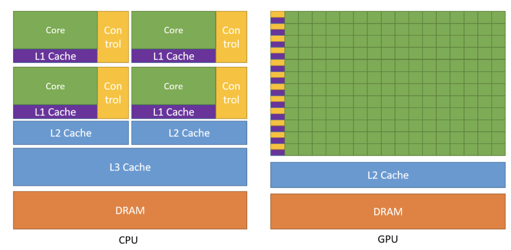
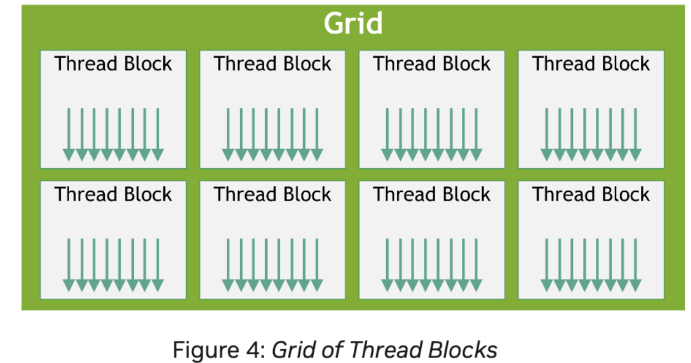
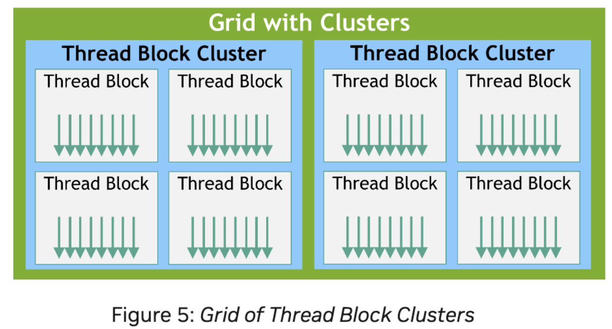
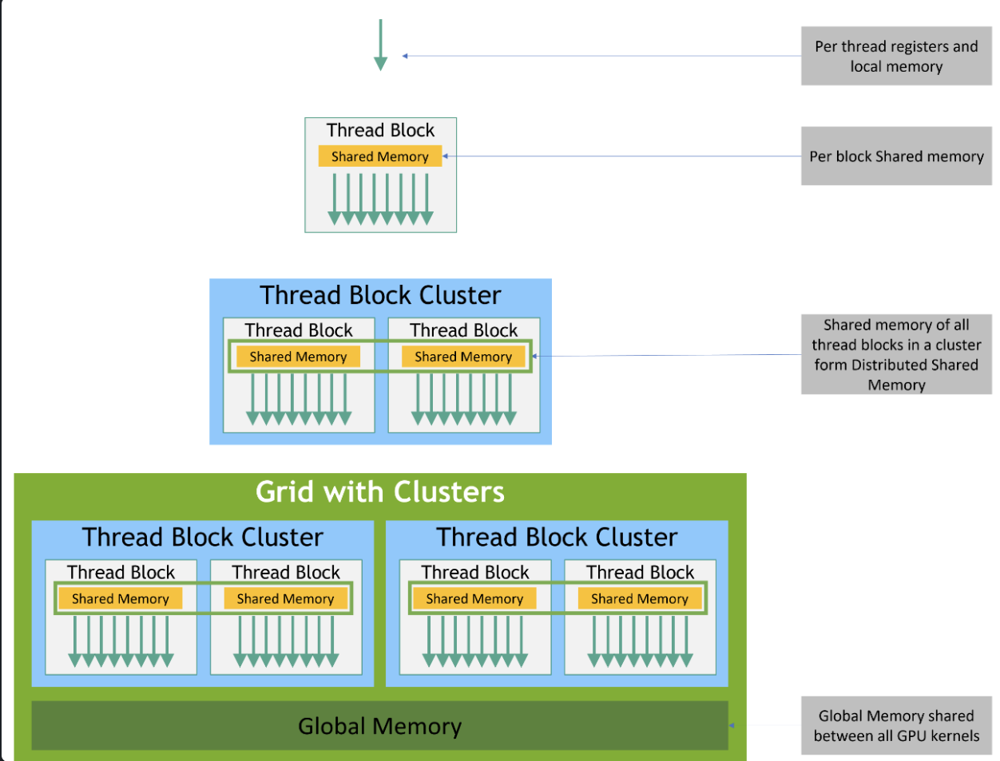

### GPU의 장점
CPU보다 더 높은 처리량과 메모리 대역폭



### Thread
다른 스레드들과 병렬 연산을 위한 독립적인 단위
각 쓰레드는 고유한 인덱스를 갖는다.

### Block
함께 실행되는 thread의 그룹
병렬 연산의 한 단위로 실행된다.
동일 블록 내에서 공유 메모리를 쓴다.

### Grid
병렬 연산의 block 모음
(grid -> block -> thread)

Grid
- Block (0,0), 
	- Thread(0, 0)
	- Thread(1, 0)
	- Thread(2, 0)
- Block (1, 0),
- Block (2, 0)

>only one block에서 Thread의 ID를 찾을 수 있다.

전역 인덱스:
`int tid = blockIdx.x * blockDim.x + threadIdx.x`

내 스레드가 전체 데이터에서 몇 번째 일을 맡아야 하는가? 
- *blockIdx.x*: 그리드 안에서 몇 번째 블록인지(0, 1, 2, ...)
- *blockDim.x*: 한 블록 안에 들어 있는 스레드 수
- *threadIdx.x*: 블록 안에서의 쓰레드 번호

tid: 전체 그리드에서 이 스레드의 전역 인덱스(global thread index)이다.

## kernel 구조

CUDA C++는 커널이라고 불리는 함수를 정의하기 위해 확장함.
global이라고 불리는 declaration을 통해 커널을 define한다.
커널을 실행하는 CUDA 쓰레드는 << >>을 통해 사용한다.

```cpp
// Kernel definition 코드
__global__ void VecAdd(float* A, float* B, float* C)
{
    int i = threadIdx.x; // 블록 내부 쓰레드 인덱스
    int i = blockIdx.x * blockDim.x + threadIdx.x; // 그리드 전체 전역 인덱스
    C[i] = A[i] + B[i]; // 각 쓰레드가 자기 i번째 원소를 더해서 저장
}

int main()
{
	int threads = 256; // threadIdx.x
	int blocks = (N + threads - 1) / threads; // blockIdx.x
	VecAdd<<blocks, threads>>(A, B, C, N);
}
```

`__global__`: 커널함수. 
호스트(CPU)에서 호출되고, *디바이스(GPU)에서 실행*되는 함수이다.
반환값을 가질 수 없고, 포인터로 받은 디바이스(float * C) 메모리에 써 넣는다.

`VecAdd<<<1, N>>>`: 실행 구성. <<<1, N>>> 에서 첫 인자 1은 그리드의 블록 수, 두번째 인자 N은 쓰레드 수

메모리 A, B, C: 디바이스 메모리여야 커널에서 접근 가능.
`cudaMalloc(&A, bytes)`으로 GPU에 할당됨. 

`cudaMemcpy`로 호스트(CPU)와 디바이스(GPU)간 통신

### Thread Hierarchy 

threadIdx: 1, 2, 3차원 vector이다. 
최대 3차원 인덱스(x, y, z) 제공
-> 1, 2, 3차원 쓰레드 블록을 생성.
블록 크기 (Dx, Dy, Dz) + 쓰레드 인덱스 (x, y, z) -> (x + yDx + zDxDy)로 쓰레드 ID
#### 블록 당 쓰레드 수의 제한이 있다?
한 블록 안의 모든 쓰레드들은 같은 streaming 멀티프로세스 코어 위에서 실행된다. -> 제한된 메모리 자원을 공유해야 한다.
GPU에서 현재 1024쓰레드를 가진다.



그리드 당 블록의 수와 블록당 쓰레드 수는 `<<<grid, block>>>` 문법으로 명시함.
각 블록들은 독립적으로 계산됨.
블록 내 쓰레드끼리는 shared memory와 동기화를 통해 데이터를 공유한다.



쓰레드 블록 클러스터: single GPU Processing Cluster 위에서 co-scheduled된다.
cluster.zync()를 통해 동기화되고, 분산 공유 메모리 접근 가능
## Memory Hierarchy



CUDA 쓰레드는 multiple memory spaces로부터 데이터에 접근한다.
각 쓰레드는 private local memory를 가지고 있다.
각 쓰레드 블록은 shared memory가 있다.
쓰레드 블록 cluster안의 쓰레드 블록은 shared memory에 있는 것을 읽고 쓸 수 있다.
모든 쓰레드들은 global memory에 접근할 수 있다.

## Heterogeneous Programming

### CPU vs GPU 메모리 종류

- *Host*: CPU와 전용 메모리인 DRAM
- *Device*: GPU와 전용 메모리인 HBM

CUDA는 각각 서로 다른 주소 공간을 가진다고 가정함.
CUDA 쓰레드는 GPU내부에서 실행된다.
host는 커널을 실행 명령을 내리고, 실제 계산은 device에서 일어난다.

kernel: GPU device에서 병렬로 실행됨
나머지: C++코드로 CPU에서 실행된다.
>CPU와 GPU가 서로 협력하는 Heterogeneous 프로그래밍 구조다

#### 1. 전통적인 메모리 관리 방법

GPU 메모리를 다룰 때 런타임 함수를 호출해야 했다.
커널이 접근할 수 있는 메모리: global memory, texture memory, constant memory

- cudaMalloc() : 디바이스 메모리 할당
- cudaMemcpy() : 호스트와 디바이스 간 데이터 복사
- cudaFree() : 디바이스 메모리 해제
#### 2. 통합 메모리를 통한 관리 방법

**managed memory**를 통해 CPU와 GPU가 같은 메모리 주소를 공유함.
cudaMallocManaged()으로 메모리 할당 가능!
