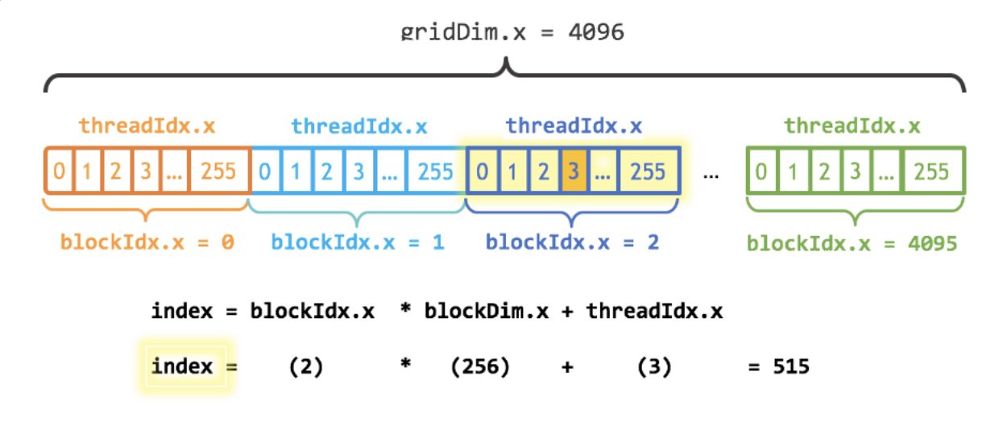

## 1. Passing Parameter

## 목표
- 직원 급여를 15% 인상하고, 5000 추가하는 작업
- CUDA 커널 실행, 동기화 학습

```c title:taskmanager.cu
#include <cuda_runtime.h>
#include <device_launch_parameters.h>
#include <iostream>
#include "TheEmployeesSalary.h"

__global__ void TaskManager(const double* array, double* newSalaries, int size) {
    // 전역 쓰레드 인덱스
    int id = blockIdx.x * blockDim.x + threadIdx.x;
    // 커널에서 경계 검사
    if (id < size) {
        newSalaries[id] = array[id] + (array[id] * 15.0 / 100.0) + 5000;
    }
    // 만약 thread idx가 size를 초과하면? 
    // 아무 동작도 하지 않고 bound check를 통해 건너뛴다.
}

int main(void) {
    // 원소 개수
    int size = sizeof(TheArrayOfSalaries) / sizeof(TheArrayOfSalaries[0]); 
    double* deviceArray; // GPU 입력 버퍼의 주소를 담는 포인터(device mem)
    double* deviceNewSalaries; // GPU 출력 버퍼의 주소를 담는 포인터(device mem)
    double newSalaries[100]; // CPU 결과 저장하는 버퍼(100개의 double)

    // 배열을 위한 연속된 메모리 확보 (배열의 크기 x 8byte 만큼)
    cudaMalloc((void**)&deviceArray, size * sizeof(double)); 
    cudaMalloc((void**)&deviceNewSalaries, size * sizeof(double));
    
    int threadsPerBlock = 256; // 블록 하나당 쓰레드 256개
    int blocksPerGrid = (size + threadsPerBlock - 1) / threadsPerBlock; // 그리드 안에 블록이 4개 존재함 = 256 * 4 = 1024
    
    // 1. host 입력을 GPU로 보낸다. (주소값을 넘겨줘야 함)
    cudaMemcpy(deviceArray, TheArrayOfSalaries, size * sizeof(double), cudaMemcpyHostToDevice);
    // 2. 커널 런치: 커널에 넘기기(디바이스 포인터)
    TaskManager<<<blocksPerGrid, threadsPerBlock>>>(deviceArray, deviceNewSalaries, size);
    // 3. gpu가 마무리할 때까지 cpu 기다림. -> (cudaMemcpy가 멈춤. 쓸 필요 없음)
    cudaDeviceSynchronize(); 
    // 4. device에 있는 newSalaries -> host로 가져오기
    cudaMemcpy(newSalaries, deviceNewSalaries, size * sizeof(double), cudaMemcpyDeviceToHost);
    
    for (int i = 0; i < size; i++) {
        printf("%f\n", newSalaries[i]);
    }
    
    // 메모리 해제 -> 누수 방지
    cudaFree(deviceArray);
    cudaFree(deviceNewSalaries);

    return 0;
}
```

### 코드 요약
CPU에서 메모리의 Salary 배열(TheArayOfSalaries)을 GPU로 보내서 `__global__` 에서 계산한 뒤, 
결과를 `cudaMemcpy`를 이용해 복사해서 host로 가져온다.

main: host에서 가장 먼저 실행하는 코드
`deviceArray`: host 배열 포인터 변수
`deviceNewSalaries`: device 배열 포인터 변수
`newSalaries[100]`: 고정 크기 배열 (나중에 복사할 대상) 

### 경계값 검사를 하지 않으면?

id가 고정 크기 배열 100을 넘으면 터진다.

```c
// 커널에서 경계 검사
if (id < size) {
	newSalaries[id] = array[id] + (array[id] * 15.0 / 100.0) + 5000;
}
```

전역 쓰레드 인덱스를 가리키는 id가 배열의 size보다 크면?
>아무 동작도 하지 않고 bound check를 통해 건너뛴다.
### 오버플로우 위험

```c
double newSalaries[100]; // 고정 크기 배열
```

고정 크기의 배열을 선언하면 오버플로우 위험
> 100개를 넘는 메모리까지 덮어쓰면, 스택 메모리 손상됨.
`std::vector<double> newSalaries(size);` 을 추천.

### 메모리 확보

```c
int size = sizeof(TheArrayOfSalaries) / sizeof(TheArrayOfSalaries[0]); // 4

// 배열을 위한 연속된 메모리 확보 (배열의 크기 x 8byte 만큼)
cudaMalloc((void**)&deviceArray, size * sizeof(double)); 
cudaMalloc((void**)&deviceNewSalaries, size * sizeof(double));
```

배열의 크기(size): 4
sizeof(double): 8byte
>한 번 호출 당 32byte -> 2번 -> 64byte를 GPU에 할당한다.

### 포인터 변수 선언

```c
double* deviceArray; // GPU 입력 버퍼의 주소를 담는 포인터(device mem)
double* deviceNewSalaries; // GPU 출력 버퍼의 주소를 담는 포인터(device mem)
double newSalaries[100]; // CPU 결과 저장하는 버퍼(100개의 double)
```

- deviceArray, deviceNewSalaries 모두 호스트에서 선언한 변수이지만, GPU에 메모리 주소를 담는다.
- newSalaries는 커널 이후 결과를 받아두는 용도.

### 커널 실행



```c
int threadsPerBlock = 256; // 블록 하나당 쓰레드 256개
int blocksPerGrid = (size + threadsPerBlock - 1) / threadsPerBlock; 
TaskManager<<<blocksPerGrid, threadsPerBlock>>>(deviceArray, deviceNewSalaries, size);
// 그리드 안에 블록이 4개 존재함 = 256 * 4 = 1024

int blockSize = 256;
int numBlocks = (N + blockSize - 1) / blockSize;
add<<<numBlocks, blockSize>>>(N, x, y);
```

gridDim: 그리드 당 쓰레드 수
### GPU가 유의미한 일을 하려면? 
gpu 메모리가 필요하다.
>cudaMalloc, cudaFree로 메모리를 할당하고 시작하자 (해제도 필수!)

### 최신 Unified Memory는 언제 쓰나?

```c
cudaMallocManaged(&c, sizeof(int));
```

개념은 cudaMemcpy와 같고, 단계가 간소화되었다.  
cache miss가 나면 os적으로 MMU라는 유닛이 판단한다.  
cudaDeviceSynchronize를 비동기적으로도 가능함.  
NVLink: cpu, gpu 연결해주는 것. (메모리에서 데이터를 얼마나 빨리 가져오는지)  
unified memory가 cache miss가 발생하면 들여다본다. -> Latency를 줄인다.  

---
## 2. Debugging

###  CUDA debugging 왜 하나?

- *비동기 실행*: CPU와 독립적으로 커널에서 실행되기 때문에, 오류가 바로 드러나지 않아 다른 곳에서 에러가 터진다.
- *멀티 스레드, 멀티 블록*: 수천 개의 쓰레드가 동시에 돌면서 경계 조건 오류, 잘못된 메모리 접근 등 쉽게 알기 어렵다.
- *디바이스 메모리와 호스트 메모리 분리*: 잘못된 cudaMemcpy방향이나 크기 계산 실수로 데이터 깨지기 쉬움.
- *탐지 어려움*: 커널 런치 실패해도 멀쩡해보임..

>CPU보다 GPU는 버그를 찾기 어려운 환경에서 실행됨.
>각 단계(할당, 복사, 런치, 동기화)마다 에러 체크가 중요함!
>NVIDIA Nsight, cuda-gdb 등의 도구를 써서 쓰레드별 실행 추적하기도 함.

### cudaError_t 체크하기

```c title:기본문법
// st(state): cudaSuccess(0) or other error codes
cudaError_t st = cudaMalloc((void**)&d_ptr, bytes);

if (st != cudaSuccess) {
    fprintf(stderr, "CUDA malloc failed: %s\n", cudaGetErrorString(st));

    return st; // 또는 오류 처리
}
```

`cudaError_t`: CUDA 런타임 함수의 반환값 타입.
### 반환값 (enum 값) 
- 성공 코드: cudaSuccess(0)
- 실패 코드: cudaErrorMemoryAllocation, cudaErrorInvalidValue, cudaErrorLaunchFailure 등
### Example

```cpp title:thread.cu
#include <cuda_runtime.h>
#include <device_launch_parameters.h>
#include <stdio.h>

__global__ void TaskManager(const double* array, double* newSalaries, int size) {
    int id = blockIdx.x * blockDim.x + threadIdx.x; // 쓰레드 인덱스
    if (id < size) {
        newSalaries[id] = array[id] + (array[id] * 15.0 / 100.0) + 5000;
    }
}
cudaError_t thehelperfunction(const double* h_in, double* h_out, int size) {
    // 1) 입력 검증
    if (h_in == NULL || h_out == NULL || size < 0) {
        return cudaErrorInvalidValue;
    };

    cudaError_t st = cudaSuccess;
    double *d_in = NULL; // device input
    double *d_out = NULL; // device output
    int threads = 256;
    int blocks = (size + threads - 1) / threads;
    size_t nbytes = (size_t)size * sizeof(double); // why?

    // 2) 디바이스 메모리 할당
    // 실패하면? cudaErrorMemoryAllocation 반환 + 바로 메모리 해제
    st = cudaMalloc((void**)&d_in, nbytes);
    if (st != cudaSuccess) goto Cleanup;

    st = cudaMalloc((void**)&d_out, nbytes);
    if (st != cudaSuccess) goto Cleanup;
    
    // 3) host -> device으로 메모리 복사
    st = cudaMemcpy((void**)d_in, h_in, nbytes, cudaMemcpyHostToDevice);
    if (st != cudaSuccess) goto Cleanup;

    // 4) 커널 런치
    TaskManager<<<blocks, threads>>>(d_in, d_out, size);
    // 4-1) LaunchError
    st = cudaGetLastError();
    if (st != cudaSuccess) goto Cleanup;
    // 4-2) SynchError
    st = cudaDeviceSynchronize();
    if (st != cudaSuccess) goto Cleanup;

    // 5) device -> host 메모리 복사
    st = cudaMemcpy(h_out, d_out, nbytes, cudaMemcpyDeviceToHost);
    if (st != cudaSuccess) goto Cleanup;

Cleanup:
    if (d_in) cudaFree(d_in);
    if (d_out) cudaFree(d_out);
    return st; // 성공이면 cudaSuccess, 실패하면 에러코드 반환
}
```

```cpp title:main.cu
#include <cuda_runtime.h>
#include <device_launch_parameters.h>
#include <stdio.h>
#include "TheEmployeesSalary.h"

cudaError_t thehelperfunction(const double* h_in, double* h_out, int size);

int main(void) {
    int size = (int)(sizeof(TheArrayOfSalaries) / sizeof(TheArrayOfSalaries[0]));
    double newSalaries[100]; // 여유 버퍼

    if (size > (int)(sizeof(newSalaries)/sizeof(newSalaries[0]))) {
        fprintf(stderr, "size too large for newSalaries buffer\n");
        return 1;
    }

    cudaError_t st = thehelperfunction(TheArrayOfSalaries, newSalaries, size);
    
    if (st != cudaSuccess) {
        fprintf(stderr, "CUDA failed: %s\n", cudaGetErrorString(st));
        return 1;
    }

    for (int i = 0; i < size; ++i) {
        printf("%f\n", newSalaries[i]);
    }
    return 0;
}
```

- *main 함수 최소화*: 커널 런치, 메모리 할당 등을 helper에 넣기 
	- main은 흐름만 담당, GPU 관련 세부 사항(cuMalloc, Memcpy, 커널 런치)은 헬퍼가 모두 처리하는 로직
	- 재사용성: GPU 계산 절차가 필요하면 바로 테스트 코드에서 재사용
	- 디버깅: GPU관련 에러는 helper함수 하나만 보면 된다!
- **size_t 변수 분리**: 큰 배열에서 정수 오버플로우 방지 -> int 범위 넘으면 음수 될 수 있다.

### 왜 헤더만 include하나?

 `TheEmployeesSalary.h`같은 배열이 들어있는 헤더 파일을 여러 .cu 파일에 include하면 각각 정의를 복사함.
 > *multiple definition error* 발생!
#### 헤더 파일 vs 소스 파일

`.h`같은 *헤더 파일*: 선언만 넣음

```cpp title:TheEmployeesSalary.h
#pragma once
extern const int kSalariesCount;
extern const double TheArrayOfSalaries[];
```

`.c, .cpp, .cu`같은 *소스 파일*: 실제 정의, 값 할당. 초기화.
```cpp title:TheEmployeesSalary.cu
#include "TheEmployeesSalary.h"
const int kSalariesCount = 100;
const double TheArrayOfSalaries[kSalariesCount] = {...};
```

#### 런타임 라이브러리

<cuda_runtime.h>는 CUDA runtime API의 헤더다.
`cudaMalloc`을 쓰면, 컴파일할 때 <cuda_runtime.h>가 선언을 알려준다.

## Reference
https://docs.google.com/presentation/d/1hlu7etZBIlf2_RHva1e2zk5oMf49gtl_-JwTaavM2Ww/edit?usp=sharing


