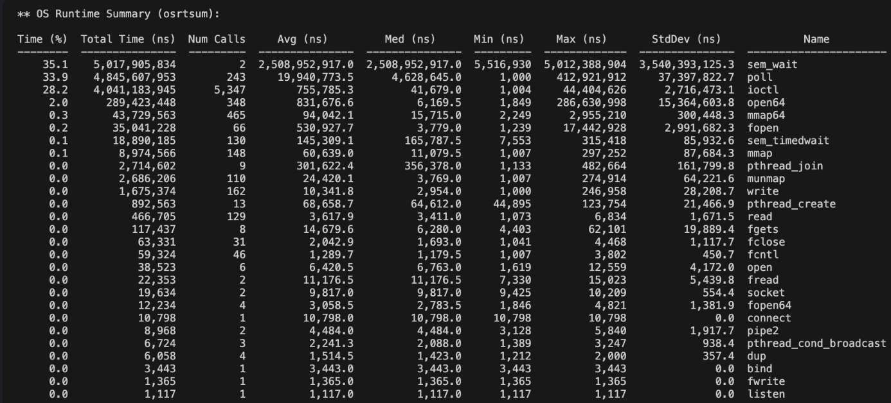
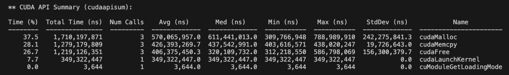

## 1. CUDA performance 분석하기
### NVIDIA Nsight Systems
nvprof는 GPU 7.5 이하에서만 지원

```bash
# profiling
nsys profile -o report main.cu

nsys stats report.nsys-rep
```
#### 1. OS Runtime Summary -> 병목 파악



- *sem_wait* (35.1%, 5초) -> CUDA작업이 완료될 때 까지 CPU가 동기화를 위해 대기함.
- *poll* (33.9%, 4.8초) -> I/O 이벤트 폴링. CUDA 드라이버가 GPU 상태를 체크함.
- *ioctl* (28.2%, 4초) -> CUDA가 GPU 드라이버와 통신

>97%가 대기/통신에서 나옴. 
실제 연산 시간은 매우 짧다.(3% 미만)

> [!NOTE] GPU 드라이버란?
> CPU, GPU 사이의 중개자.
> 하는 일: 메모리관리, VRAM에서 빈 공간 찾기, 데이터 전송(CPU -> GPU), 커널 실행, 블록/쓰레드 스케줄링, 동기화 등

#### 2. CUDA API Summary -> 실행 시간 파악



- *cudaMalloc* (37.5%, 1.17초)
	- min: 309ms, max: 788ms.
	- 첫 호출에 CUDA 컨텍스트 생성, GPU 초기화하는 작업이 느림.
	- but 실제 메모리 할당은 빠름
- *cudaMemcpy* (28.1%, 1.28초) -> 버스 대역폭 제한. 
	- 전송 횟수 줄이기
	- 큰 데이터는 한 번에 전송하기
	- pinned memory 사용하기
- *cudaFree* (26.7%, 1.22초) -> GPU 작업 완료 대기.
- *cudaLaunchKernel* (7.7%, 0.35초) -> 실제 커널 실행 시간(vectorAdd함수)

>실제 연산하는데 걸린 시간은 8%밖에 안된다.
>92%가 오버헤드
## 2. 어떻게 최적화하면 좋을까?

```cpp
// 최적화된 코드
#include <stdio.h>
#include <cuda_runtime.h>

__global__ void vectorAdd(float *A, float *B, float *C, int N)
{
    int i = blockDim.x * blockIdx.x + threadIdx.x;
    if (i < N) {
        C[i] = A[i] + B[i];
    }
}

int main()
{
    int N = 1000000;
    size_t size = N * sizeof(float);
    
    printf("=== 좋은 버전 (최적화됨) ===\n");
    printf("벡터 크기: %d 원소\n\n", N);
    
    float *d_A, *d_B, *d_C;
    cudaMalloc(&d_A, size);
    cudaMalloc(&d_B, size);
    cudaMalloc(&d_C, size);
    
    float *h_A = (float*)malloc(size);
    float *h_B = (float*)malloc(size);
    float *h_C = (float*)malloc(size);
    
    for (int i = 0; i < N; i++) {
        h_A[i] = i;
        h_B[i] = i * 2;
    }
    
    cudaMemcpy(d_A, h_A, size, cudaMemcpyHostToDevice);
    cudaMemcpy(d_B, h_B, size, cudaMemcpyHostToDevice);
    
    int threadsPerBlock = 256;
    int blocksPerGrid = (N + threadsPerBlock - 1) / threadsPerBlock;
    
    for (int iter = 0; iter < 10; iter++) {
        vectorAdd<<<blocksPerGrid, threadsPerBlock>>>(d_A, d_B, d_C, N);
    }
    
    cudaDeviceSynchronize();
    
    cudaMemcpy(h_C, d_C, size, cudaMemcpyDeviceToHost);
    
    printf("%.1f, %.1f, %.1f\n", h_A[999999], h_B[999999], h_C[999999]);
    
    cudaFree(d_A);
    cudaFree(d_B);
    cudaFree(d_C);
    free(h_A);
    free(h_B);
    free(h_C);

    return 0;
}
```

### 1. 메모리 할당/해제를 최소화

```cpp
// ❌ 나쁜 예
for (int i = 0; i < 1000; i++) {
   cudaMalloc(...);
   kernel<<<...>>>();
   cudaFree(...);
}

// ✅ 좋은 예
cudaMalloc(...);
for (int i = 0; i < 1000; i++) {
   kernel<<<...>>>();
}
cudaFree(...);
```

runtime이 긴 cudaMalloc, cudaFree를 최소화하기
### 2. 메모리 전송 최소화

```cpp
cudaMemcpy(d_A, h_A, size, cudaMemcpyHostToDevice);
    cudaMemcpy(d_B, h_B, size, cudaMemcpyHostToDevice);
```
### 3. 커널만 반복하기
- 한 번의 초기화 + 여러 커널 실행 -> 높은 GPU 활용도

```bash
# 1. 컴파일
nvcc -o vector_add_bad vector_add_bad.cu
nvcc -o vector_add_good vector_add_good.cu

# 2. 실행
./vector_add_bad
./vector_add_good

# 3. 프로파일링
nsys profile --stats=true -o bad_profile ./vector_add_bad
nsys profile --stats=true -o good_profile ./vector_add_good

# 4. 통계 비교
nsys stats --report cuda_api_sum bad_profile.nsys-rep
nsys stats --report cuda_api_sum good_profile.nsys-rep

# 5. 커널 실행 통계
nsys stats --report cuda_gpu_kern_sum bad_profile.nsys-rep
nsys stats --report cuda_gpu_kern_sum good_profile.nsys-rep
```
### 차이 비교
#### 나쁜 코드: 41.37초
- cudaMalloc: 11.74초 (28.4%)
- cudaMemcpy: 12.80초 (30.9%)
- cudaFree: 12.95초 (31.3%)
- cudaLaunchKernel: 3.88초 (9.4%)

#### 좋은 코드: 7.97초
- cudaMalloc: 1.45초 (18.2%)
- cudaMemcpy: 1.14초 (14.3%)
- cudaFree: 1.11초 (13.9%)
- cudaLaunchKernel: 3.83초 (48.1%)

>총 실행 시간: 41.37초 -> 7.97초 (33.4초 절약)

*만약 1000번 실행한다면?*
나쁜 코드: 41.37 x 1000 = 11.5시간  
좋은 코드: 7.97 x 1000 = 2.2시간  
>하루에 9.3시간을 절약할 수 있다.

## 결론

gpu가 놀지 않게 하려면, 오버헤드를 줄이는 것이 핵심이다.
특히 cudaMalloc, cudaMemcpy, cudaFree는 최소화하자.
동기화는 필요할 때만 하자. 커널은 많이 실행해도 된다. 
