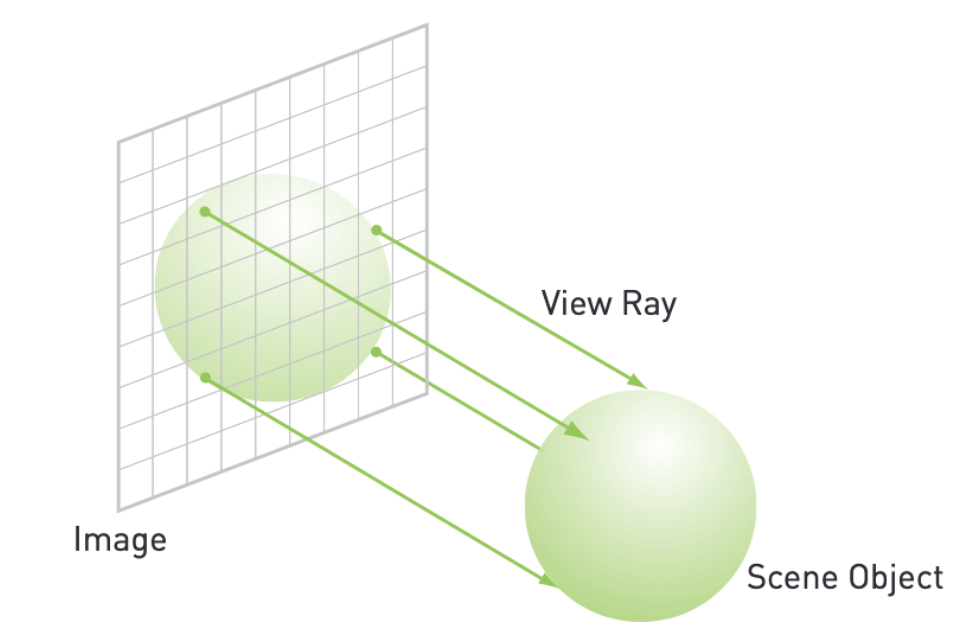
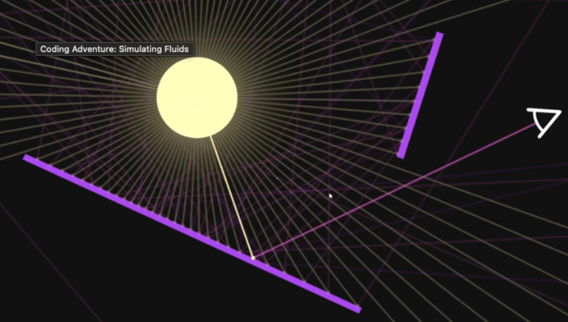
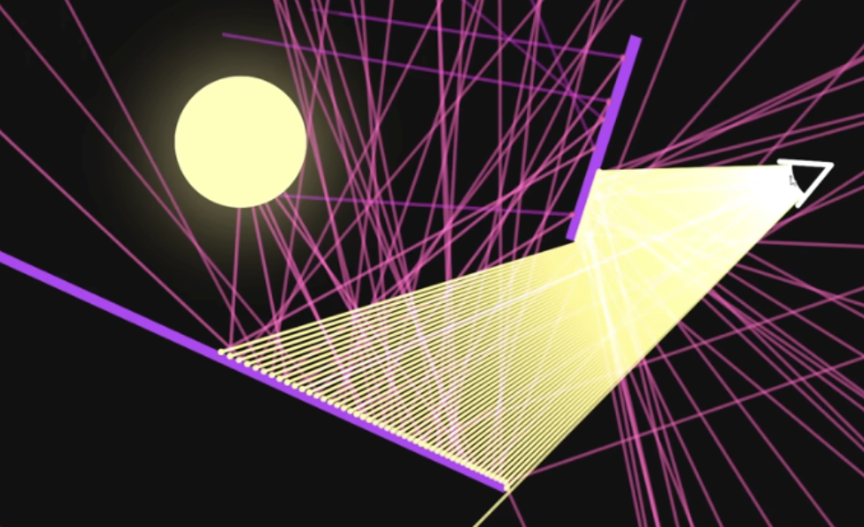

## 6.1 Chapter Objectives

- GPU에 있는 *constant memory* 활용하기
- CUDA C 앱의 퍼포먼스 향상
- *CUDA events*를 활용한 퍼포먼스 측정.

## 6.2 Constant Memory

GPU의 연산에서 병목은 칩의 처리량이 아니라, *메모리 대역폭*때문에 발생한다.
GPU에 있는 많은 ALU 들어오는 input을 충분히 빠르게 처리할 수 없다.

>memory traffic을 줄여야 한다.

global & shared memory를 지금까지 사용해왔다
constant memory는 메모리 대역폭을 줄일 수 있다. 
- 읽기 전용 메모리.
- 모든 쓰레드에서 접근 가능
- `__constant__` 키워드로 선언.
- 호스트에서 `cudaMemcpyToSymbol()`로 값 설정
- 캐시되어있어서 모든 쓰레드가 같은 주소를 읽을 때 빠르다.
- 64KB로 제한.
- 커널 파라미터같은 변하지 않는 데이터 저장에 적합.

> [!NOTE] global memory
> GPU의 가장 큰 메모리 but 가장 느림.
> GPU <-> CPU 간 데이터 전송.
> `cudamalloc()`으로 할당함.
> 모든 쓰레드 블록, 그리드 전체에서 접근 가능.

> [!NOTE] Shared memory
> 모든 쓰레드가 공유하는 고속 on-chip 메모리.
> 레이턴시 매우 낮고, 스레드 간 협력 및 재사용에 최적화.
> 48KB에 불과.
### Ray tracing on the GPU

3차원 장면에서 2차원 이미지를 생성하는 렌더링 방식.
각 pixel을 향해 ray를 쏘고, 그 광선이 3D장면의 오브젝트를 추적하는 것.



2d image에서 각 픽셀이 
각 픽셀마다 3D장면으로 간다.
3개의 녹색 화살표가 다른 픽셀에서 출발한 view ray이다.

우리 눈: 광원 -> 물체 -> 눈

레이 트레이싱: 눈 -> 물체 -> 광원


중요한 것: 어떤 ray이 pixel을 hit하는가?

각 pixel이 무슨 색을 봐야 하는지 광선을 쏴서 알아낸다.
1. pixel에서 ray를 쏜다.
2. ray가 오브젝트에 부딪힌다.
3. 부딪힌 오브젝트의 색상을 그 픽셀에 할당한다.
>ray tracing에서 가장 무거운 연산은 "ray와 object의 교차점 계산"

### GPU에서 Ray Tracing구현
openGL, DirectX같은 그래픽 API는 ray tracing용이 아님.

- 구체만 지원
- z 축 카메라 고정
- 조명 없음
- 각 구체에 색상만 지정
- 미리 계산된 함수로 음영 처리

```c
struct Sphere {
    float r, g, b;
    float radius;
    float x, y, z;

    __device__ float hit(float ox, float oy, float *n) {
        float dx = ox - x;
        float dy = oy - y;

        if (dx*dx + dy*dy < radius*radius) {
            float dz = sqrtf(radius*radius - dx*dx - dy*dy);
            *n = dz / sqrtf(radius*radius);
            return dz + z;
        }
        return -INF;
    }
};
// constant memory 사용: 모든 스레드가 같은 구체 데이터를 읽음
__constant__ Sphere s[SPHERES];

// Ray tracing
__global__ void kernel(unsigned char* ptr) {
    int x = threadIdx.x + blockIdx.x * blockDim.x;
    int y = threadIdx.y + blockIdx.y * blockDim.y;
    // 2D 픽셀 좌표 -> 1D 배열 인덱스
    int offset = x + y * blockDim.x * gridDim.x;
	// 픽셀 좌표 -> 3D 공간 좌표
    float ox = x - DIM/2.0f;
    float oy = y - DIM/2.0f;
    // ray tracing 초기화
    float r = 0, g = 0, b = 0;
    float maxz = -INF; // 깊이
    // 교차 연산: ray가 i번째 구체와 만나는가?
    for (int i = 0; i < SPHERES; i++) {
        float n;
        float t = s[i].hit(ox, oy, &n);
        if (t > maxz) {
            float fscale = n;
            r = s[i].r * fscale;
            g = s[i].g * fscale;
            b = s[i].b * fscale;
            maxz = t;
        }
    }
	// 색상 추가
    ptr[offset*4 + 0] = (int)(r * 255);
    ptr[offset*4 + 1] = (int)(g * 255);
    ptr[offset*4 + 2] = (int)(b * 255);
    ptr[offset*4 + 3] = 255;
}
```
#### code 설명
1. sphere 구조체: 각 구체의 색상(rgb), 반지름(r), 위치(xyz) 저장
2. constant memory: 모든 쓰레드가 공유됨. 20개 구체 데이터 저장.
3. kernel: 각 픽셀마다 ray tracing 수행. 스레드 동시 실행.
4. hit(): 모든 구체 20개를 루프로 돌면서 하나의 ray와 하나의 구체의 교차 연산 (device에서 실행) -> 가장 가까운 구체를 찾아서 shading, 색상을 픽셀에 기록.
#### CPU, GPU 모두 메모리를 할당하는 이유
- 데이터 생성: CPU 메모리에서 랜덤 구체 생성 (malloc)
- 데이터 전송: CPU -> GPU (cudaMemcpyToSymbol)
- 데이터 사용: GPU에서 ray tracing 계산 (constant memory 읽기)
>각 pixel을 통과하는 ray가 어떤 sphere와 교차하는지 계산하여, 가장 가까운 sphere의 색상과 shading을 pixel에 할당한다.
### Constant memory 사용법

```c
__constant__ Sphere s[SPHERES]; 

// host memory에서 constant memory로 copy할 때
cudaMemcpyToSymbol(s, temp_s, sizeof(Sphere) * SPHERES);
```

cudaMalloc()을 사용하지 않는다.
cudaMemcpyToSymbol: constant memory에 복사한다.
cudaMemcpy: global memory에 복사한다.
### Performance with constant memory

메모리에 `__constant__`를 선언하면, read-only가 되도록 제한한다.
64KB의 constant memory에서 읽는 것이 bandwidth를 save할 수 있다.

- single read가 거의 다른 쓰레드에 broadcast할 수 있다. (15read를 세이브)
- constant memory는 cached되어, 같은 주소를 연속적인 읽기는 추가적인 메모리 traffic을 유발하지 않는다.

>half-warp: 16개의 쓰레드 그룹
>한 warp안의 쓰레드들은 다른 데이터에서 같은 instruction을 수행한다.

#### half-warp broadcast
NVIDIA 하드웨어는 single memory를 읽을 수 있게 half-warp로 브로드캐스트한다.

모든 스레드가 같은 주소 읽기:
Thread 0: s[0] 읽기 요청
Thread 1: s[0] 읽기 요청  
Thread 2: s[0] 읽기 요청
...
Thread 15: s[0] 읽기 요청

1. 대역폭 절감
GPU가 1번만 읽어서 16개에게 broadcast시키면, 메모리 traffic이 1/16으로 감소한다.
2. 캐싱 효과
처음에는 constant memory에서 가져와 캐시에 저장한다.
이후, 모든 쓰레드가 캐시에서 data를 읽는다.

### 단점
만약 16개의 모든 쓰레드가 다른 주소를 읽으면...?

Thread 0: s[0] 읽기
Thread 1: s[1] 읽기  
Thread 2: s[2] 읽기
...
Thread 15: s[15] 읽기

>16개의 요청이 serialized된다. (global memory보다 느림)

## 6.3 Measuring performance with events

왜 CUDA event를 사용하나?
### cpu 타이머의 문제

- 레이턴시, 여러 자원의 variation을 포함함.
- GPU는 비동기적으로 실행됨. 아직 실행중일 수 있다.
- GPU가 작업에 쓰는 시간 측정 불가

### cuda event의 장점

- GPU timestamp 찍기
- CPU의 간섭 없이 순수하게 GPU의 특정 작업 시간을 측정할 수 있다.

```c
cudaEvent_t start, stop;
cudaEventCreate(&start);
cudaEventCreate(&stop);
```

### 비동기 실행의 문제

```c
cudaEvent_t start, stop;
cudaEventCreate(&start);
cudaEventCreate(&stop);
cudaEventRecord(start, 0);

kernel<<<grids, threads>>>();

cudaEventRecord(stop, 0); // -> GPU 작업이 종료됨
// CPU는 계속 진행됨...
```

CUDA C는 비동기적이기 때문에 발생한다.
#### CPU
`cudaEventRecord(start, 0)`: GPU 큐에 start 기록 명령 추가
-> `kernel<<<>>>()`: GPU 큐에 kernel 작업 추가
-> `cudaEventRecord(stop, 0)`: GPU 큐에 stop 기록 명령 추가
-> GPU가 안끝났는데 계속 다음 코드를 실행
#### GPU
start 기록 실행
-> kernel 실행 
-> stop 기록 실행

### 해결책

`cudaEventSynchronize()`: CPU에게 stop이벤트가 완료될 때까지 기다리게 함.

```c
// 1. event 생성
cudaEvent_t start, stop;
cudaEventCreate(&start);
cudaEventCreate(&stop);

// 2. 시작 시점 기록
cudaEventRecord(start, 0);

// 3. 측정할 GPU 작업 실행
kernel<<<grids, threads>>>();

// 4. 종료 시점 기록
cudaEventRecord(stop, 0);

// 5. GPU 완료될 때까지 CPU 대기
cudaEventSynchronize(stop);

// 6. 총 시간 계산
float elapsedTime;
CUDA_CHECK(cudaEventElapsedTime(&elapsedTime, start, stop));
printf("Time: %.1f ms\n", elapsedTime);

// 7. 정리
cudaEventDestroy(start);
cudaEventDestroy(stop);
```

## 6.4 Chapter Review

|     | global memory | shared memory | constant memory               |
| --- | ------------- | ------------- | ----------------------------- |
| 크기  | 매우 큼          | 작음            | 매우 작음(64KB)                   |
| 속도  | 느림            | 빠름            | 특정 상황에서 빠름                    |
| 접근  | 모든 스레드/블록     | 같은 블록 내 스레드   | 모든 스레드/블록                     |
| 권한  | 읽기, 쓰기        | 읽기, 쓰기        | 읽기 전용                         |
| 선언  | `__device__`  | `__shared__`  | `__constant__`                |
| 할당  | cudaMalloc()  | 직접 쓰기         | cudaMemcpyToSymbol()          |
| 활용  | 대용량 입출력 데이터   | 블록 내 데이터 재사용  | warp 내 모든 쓰레드들이 같은 데이터에 접근할 때 |

